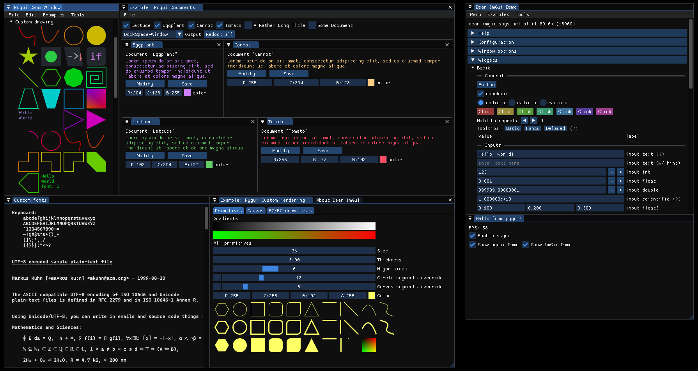
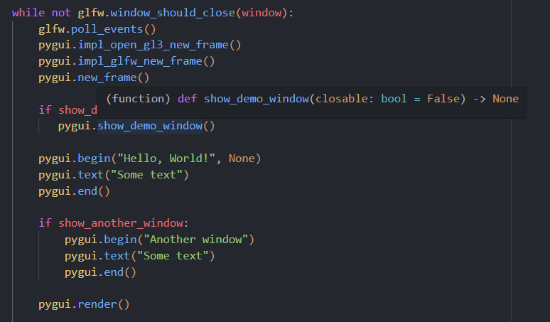

# pygui

Pygui is a dynamic wrapper for [Dear ImGui](https://github.com/ocornut/imgui) using Cython.



## Features

1. Imgui Docking Support.
2. Imgui Multi-Viewport Support.
3. Intellisense Support. (`__init__.pyi` file)
4. Uses Imgui's `glfw_opengl3` backend. Minimal understanding of OpenGL is needed.
5. Includes an extensive pygui example (and a minimal c example).



This project uses [dear_bindings](https://github.com/dearimgui/dear_bindings) as the C base. Pygui is inspired by [pyimgui](https://github.com/pyimgui/pyimgui).

## Why choose pygui over other ImGui python wrappers?

1. The binding is **auto-generated**:

    Over time, the API for ImGui will change, and so keeping up with the changes is hard if you plan on manually updating the wrapper to match the changes. Pygui fixes this by dynamically generating the binding between cimgui and python to *significantly reduce* the manual work required to maintain the wrapper.

    Every struct and function (within reason) is mapped from cimgui to pygui. You as a user can then choose to activate and/or modify a default wrapper of the function. In a majority of cases the default implementation will work out-of-the-box, but for more complicated functions (like mapping python lists to c arrays), some manual work is required.

    This also meant that including **docking** and **multi-viewport** support was easy. I just switched branch and rebuilt the binding! As time progresses, this repository should continue to be useful.

2. Writing pygui code is *almost* exactly the same as writing imgui code.

    A deliberate choice of pygui is to match imgui's API as much as possible. I'm not interested in adding wrapper `App` classes or anything like that. Pygui is just a wrapper! Setting up the glfw context is left to user, (exactly like imgui's minimal examples!).

    Secondly, function calls match imgui as much as possible. Where imgui expects (for example) `int*` parameters, these have been replaced with pygui wrappers, so that the `input_` style functions work exactly like they do in imgui. There is no weird returning of multiple values in a tuple to retrieve inputs.

3. An `__init__.pyi` file is included with comments from cimgui.

    This makes developing with pygui much easier because many code editors recognise the `__init__.pyi` as the interface and such will do intellisense using it. No red squiggly lines, no guessing of function parameters, and no need to check imgui.h for comments.'

4. An extensive pygui demo window is included (`pygui_demo.py`).

    Some other wrappers don't include an example. My demo window tests all the functions, methods, and fields in pygui. It even has some functions from the imgui demo done in pygui, just to show that even the most complicated of features is not only possible in python, but often much simpler too.

5. It's fast, because you spend a minimal amount of time inside Python.

    Pygui uses imgui's backend so all of the rendering is in c++. I don't need to maintain a rendering context inside Python. The imgui devs have done it for me. But, you can still write your own renderer if you need, because the vertices (etc) are still available to be read in python.

## Limitations

1. The current build assumes windows as the platform. Some work would be required to enable linux/mac builds.
2. glfw/cimgui/imgui_impl need to be linked at runtime (dll) which may hurt performance slightly.
3. Not all imgui functions are activated. This is by design so that I can verify a function's template implementation works before activating it. See "Developing pygui" down below for more information.
4. More work would be required to enable additional backends. I've attempted to make this easier though the modular nature of the CMake script and binding generator script.
5. No `with` functionality has been added. No being lazy; your `pygui.begin()` must have a `pygui.end()`.

## How to run

You will need:

- git
- python (pip)
- cmake

First, download this repository recursively:

```bash
git clone --recursive https://github.com/JaedanC/pygui.git
```

Then, I suggest checking out the ImGui `docking` branch. Any commit can be used if you want.

```bash
cd src/external/imgui
git checkout docking
```

## Running ImGui

To compile pygui you will first need to complete a few steps. These are broadly the steps I will take you through.

1. Install python dependecies.
2. Run `dear_bindings`'s binding generation script.
3. Compile cimgui, glfw, and the implementations as shared dlls.
4. *Optionally:* Add function definitions for yet to be implemented pygui functions.
5. Compile the cython into a python module.

### 1. Install python dependencies

Run:

```bash
pip install -r requirements.txt
```

You may choose to use `venv`, but this is outside the scope of this tutorial.

### 2. Running dear_binding

Navigate to `src/external/dear_bindings` and run:

```bash
python dear_bindings.py -o cimgui ../imgui/imgui.h
```

### 3. Compiling cimgui

This step will compile:

- cimgui
- imgui_glfw_opengl3
- glfw

...As shared `.dll`'s so that you can recompile each module and/or include extra implementations as a dll. It is very important that glfw is NOT compiled statically. If it is compiled statically then python's glfw will refer do a different instance, causing imgui to crash on startup.

You may use Visual Studio or the command-line (developer console on windows) to run CMake. I will be using Visual Studio.

Configure (build) CMake and then CMake "Install". This will build the targets and save them to `src/pygui`. An additional `./src/pygui/my_program.exe` has been included that compiles from `main.c`. This is to demonstrate the `dll`'s in action. If this program does not run correctly, then the `dll`'s are not ready for python.

### 4. (Optionally) Create new pygui function definitions

See Developing pygui

### 5. Compiling pygui

To compile pygui run `setup.py` like so:

```bash
cd src
python setup.py clean build_ext --build-lib pygui
```

This will compile to `./src/pygui`:

- The `core*.pyd` file. This contains the cython binding.
- The `__init__.py` file. This allows the `pygui` directory to be imported as `import pygui`
- The `__init__.pyi` file. This gives the `pygui` module correct intellisense in editors as cython does not export symbols.

It will also copy the entire `pygui` python module to directory called `portable`. This new directory will contains everything required for a new `pygui` project to be portable. It will not include the `src/pygui/libs` directory or `my_program.exe`.

## Developing pygui

To develop pygui, it's important that steps 1-3 are completed.

After that, you can then begin to modify the bindings. More on that in the next section. But for now, let's look at how you would generate the bindings:

```bash
cd src
python model_creator.py --all
```

Then run the cython compiler again:

```bash
python setup.py clean build_ext --build-lib pygui
```

You can test the application with:

```bash
python app.py
```

## How are bindings created?

Bindings are creating by reading the output of dear_binding's `cimgui.json` that contains information about the cimgui implementation. This file is parsed and then used to create three files:

1. `pxd`: (Located at `src/core/ccimgui.pxd`) This files contains all the 1 to 1 definitions that are defined inside `cimgui.h` (Located at `src/external/dear_bindings/cimgui.h`) and any defined backends. This file does not need to be touched if the API changes.
2. `pyx`: (Located at `src/core/core.pyx`) This file contains the generated cython that will be compiled. This file can be editted if you want, but new additions should instead be put inside `src/core/core_template.pyx`. More on this later.
3. `pyi`: (Located at `src/pygui/__init__.pyi`) This file contains the cython function definitions so that intellisense on editors work correctly with pygui. Cython does not export any symbols so this file is required if you don't want squiggly lines everywhere in your editor, (and if you want comments!).

The `src/core/core_template.pyx` is the file that should be editted if you want to change any implementation between python and cimgui. This file is the go-between, needing to marshall types between python and c. **Functions are disabled by default**, but then can be turned on by changing `active` to True. Example:

Quick note on options:

- `use_template`: When False, this function will be overridden by the default generated implementation. This can be good for resetting a function if you break it, or if the API changes.
- `active`: When False, this function will be commented out in `core.pyx` when the pygui binding is created. This can be a handy way to disabling a function while also keeping a record of the existing implementation.
- `invisible`: When True, this function will not be added to `__init__.pyi`, effectively rendering the function as invisible inside the API. It can still technically be called if the function is also `active`.
- `custom_comment_only`: When True, the comment will use the template. This does not need to be True if `use_template` is True. This let's you modify the comment while keeping the default generated implementation.

```python
# [Function]
# ?use_template(False)
# ?active(True)
# ?invisible(False)
# ?custom_comment_only(False)
# ?returns(None)
def show_demo_window(p_open: Bool=None):
    """
    Demo, Debug, Information
    Create demo window. demonstrate most imgui features. call this to learn about the library! try to make it always available in your application!
    """
    ccimgui.ImGui_ShowDemoWindow(
        Bool.ptr(p_open)
    )
# [End Function]
```

When `use_template` is True, the function can be editted however you like. This includes including the name of the function, its parameters, and the function comment. You also have the ability to change what the function returns. This value is what will be used inside the `__init__.pyi` file. Cython syntax and usage can be found online, but here are a few tips:

1. Most functions are templated corrently, but some require manual modification to work.
2. `char *` and `str` can be converted to and from using `_bytes` and `_from_bytes`. See: `begin()` and `get_version()`.
3. Tuples and ImVec2 can be converted using `_cast_tuple_ImVec2` and `_cast_ImVec2_tuple`. Use respective functions for ImVec4.
4. Instances of classes returned cannot store any information on them because they simply serve as wrappers for a pointer to the real instance in c. Any information required to be stored on a class should instead be written to a dictionary inside cython. See `input_text` and `get_clipboard_text_fn`.
5. Converting to and from lists is much harder. Consider looking at `ImGuiTableSortSpecs.specs` and `ImDrawList.cmd_buffer`.
6. Most pointers have been wrapped inside a `pygui.<type>()` class (eg: `pygui.Float()`). This allows for the function signatures between imgui and pygui to match very closely, without an overreliance on tuples.
7. Dear bindings accounts for languages without default function parameters, but since python supports them, many function calls where appropriate use the `*_ex()` variant while retaining the original name.

Running `./src/model_creator.py` with no options will give you a better look into the options provided. Importantly, whenever the pyx is generated, this will read `core_template.pyx` and merge it with `core_generated.pyx` to create `core.pyx`. **If a function inside `core_template.pyx` is not marked as `use_template`, it will be reset to whatever is inside `core_generated.pyx` and `core_template.pyx` will be modified!**. This is by design.

If you are unsure about the output, run `python model_creator.py --trial`. This will generate `*_trial.pyx` versions of `core.pyx` and `core_template.pyx` so you can see what each file *would* look like if you ran `model_creator.py --pyx`.

## Can pygui wrap ...*insert imgui extension here*?

In theory, yes. Because the way that pygui is compiling-in the implementation headers is using the process that could be ported to other c++ ImGui extensions. See `src/core/backends/*.json` and `src/config.json`.

As long as all the functions in the header are defined in the format that is generated by `dear_binding`, then in theory you should be able to include your library.

Make sure that when you compile, you have similar settings in CMake:

```txt
# my_imgui_extension.dll
# Layout:
#  - define:
# 		IMGUI_API __declspec(dllimport)
#  - include
#       imgui.h directory
#  - src:
#       {extension sources}
#  - links:
#       cimgui
```

ImGui needs to be dynamically linked at runtime. This process would not be trivial, but the infrastructure is there. This is the beauty of dynamically generated bindings.
