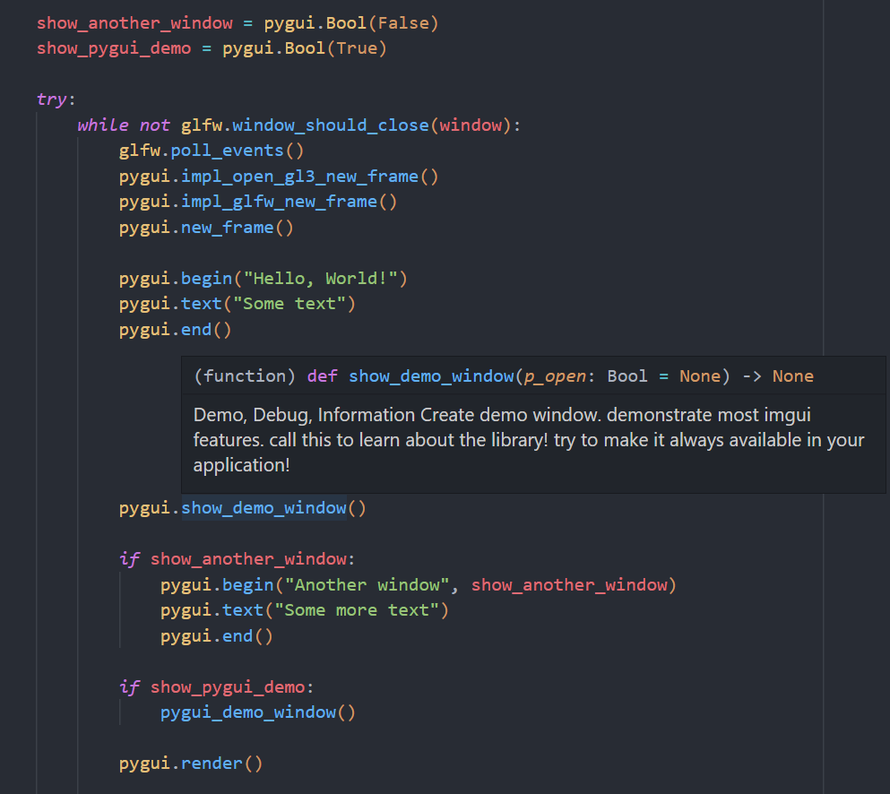

# pygui

Pygui is a dynamic wrapper for [Dear ImGui](https://github.com/ocornut/imgui) using Cython.


ImGui Version: `v1.92.2b-docking`
Python Version: `Python 3.12.10`

## Features

1. Imgui Docking Support.
2. Imgui Multi-Viewport Support.
3. Intellisense Support. (`__init__.pyi` file)
4. Uses Imgui's `glfw_opengl3` backend. Minimal understanding of OpenGL is needed.
5. Includes an extensive pygui example (and a minimal c example).



This project uses [dear_bindings](https://github.com/dearimgui/dear_bindings) as the C base. Pygui is inspired by [pyimgui](https://github.com/pyimgui/pyimgui).

## Why choose pygui over other ImGui python wrappers?

1. The binding is **auto-generated**:

    Over time, the API for ImGui will change, and so keeping the wrapper up the date can be tedious. Pygui fixes this by dynamically generating the binding between dcimgui and python to **significantly reduce** the manual work required.

    Every struct and function in dcimgui can be mapped to python through cython. You as a user can then choose to activate and/or modify a default wrapper of the function. In a majority of cases the default implementation will work out-of-the-box, but for more complicated functions (like mapping python lists to c arrays), some manual work is required.

    This also meant that including **docking** and **multi-viewport** support was easy. I just switched branch and rebuilt the binding!

2. Writing pygui code is *almost* exactly the same as writing imgui code.

    A deliberate choice for pygui was to match ImGui's API as much as possible. Pygui does **NOT** have, an `App` class with a main function, `with` clauses for auto `begin()` and `end()`, odd behaviour that removes the immediately-mode-ness of ImGui. Pygui is just a wrapper! Setting up the glfw context is left to user exactly like ImGui's minimal examples!

    Consequently, pygui codes looks extremely similar to ImGui code. Where ImGui expects (for example) `int*` parameters, these have been replaced with pygui wrappers, so that the `input_` style functions work exactly like they do in imgui. There is no weird returning of multiple values in a tuple to retrieve inputs.

    The only additions are designing around C complexity. For example, functions that expected arrays can now take python lists, callbacks functions now take python functions pointers, and userdata can be supplied with arbitrary python objects, to name a few. Basically, you leverage what makes Python a great language; It's ease of use!

3. An `__init__.pyi` file is included **with comments** from dcimgui.

    This makes developing pygui much easier than other wrappers because many code editors will perform intellisense on `__init__.pyi`. No red squiggly lines, no guessing of function parameters, and no need to check `imgui.h` for comments.

4. An extensive pygui demo window is included (`pygui_demo.py`).

    Some other wrappers don't include an example. My demo window tests many functions, methods, and fields from the wrapper. You will be surprised that even the most complicated of features is not only possible with pygui, but often much simpler to create than ImGui.

5. It's performant, because you spend a minimal amount of time inside Python.

    Pygui uses ImGui's backend so all of the rendering is in c++. You don't need to maintain a rendering context inside Python. The ImGui devs have done it for us. But, you can still write your own renderer if you need, because the draw data is still available to be read from Python.

## Limitations

1. The current build assumes windows as the platform. Some work would be required to enable linux/mac builds.
2. glfw and dcimgui is linked at runtime with a DLL which may hurt performance slightly.
3. Not all ImGui functions are activated, but with some work more can be. This is by design so that I can verify a function's template implementation works before activating it. See "Developing pygui" down below for more information.
4. More work would be required to enable additional backends. Since dcimgui also wraps backends too, this should be possible to do as long as you have a way to write the c++ minimal example in Python.

## Getting Started

The easiest way to get started with pygui is to download the release. This includes pygui and dcimgui precompiled into a python package that can be imported. Just extract the contents to your Python project folder.

Make sure you have installed the [Latest Microsoft Visual C++ Redistributable Version](https://learn.microsoft.com/en-US/cpp/windows/latest-supported-vc-redist).

Open a terminal to the same directory as `app.py` and run:

```bash
pip install -r requirements.txt
python app.py
```

## Compiling pygui

To compile pygui you will need:

- git
- python (pip)
- cmake

And these are the steps we will complete:

1. Install python dependecies.
2. Run `dear_bindings`'s binding generation script.
3. Compile dcimgui, glfw, and the implementations as shared dlls.
4. *Optionally:* Add function definitions for yet to be implemented pygui functions.
5. Compile the cython into a python module.

First, download this repository recursively:

```bash
git clone --recursive https://github.com/JaedanC/pygui.git
```

Then, I checkout out the ImGui branch that you wish to compile. I recommend checking out the `docking` branch, but any commit/tag can be used.

```bash
cd src/external/imgui
git checkout docking
```

### 1. Install python dependencies

Run:

```bash
pip install -r requirements.txt
```

Note: Using a `venv` is recommended.

### 2. Running dear_binding

Navigate to `src/external/dear_bindings` and run:

```bash
.\BuildAllBindings.bat
```

### 3. Compiling dcimgui

This step will compile:

- dcimgui
- glfw

...As shared `.dll`s. It is very important that glfw is **NOT** compiled statically. If it is compiled statically then python's glfw will refer do a different instance, causing ImGui to crash on startup.

You may use Visual Studio or the command-line (developer console on windows) to run CMake. I will be using Visual Studio.

Configure (build) CMake and then CMake "Install". This will build the targets and save them to `src/pygui`. An additional `./src/pygui/my_program.exe` has been included that compiles from `main.c`. This is to demonstrate the `dll`'s in action. If this program does not run correctly, then the `dll`'s are not ready for python.

You can choose debug or release for cmake. All github releases (from 1.90.6+) are built in release.

### 4. (Optionally) Create new pygui function definitions

See Developing pygui

### 5. Compiling pygui

To compile pygui run `setup.py` like so:

```bash
cd src
python setup.py clean build_ext --build-lib pygui
```

This will compile to `./src/pygui`:

- The `core*.pyd` file. This contains the cython binding.
- The `__init__.py` file. This allows the `pygui` directory to be imported as `import pygui`
- The `__init__.pyi` file. This gives the `pygui` module correct intellisense in editors as cython does not export symbols.

It will also copy the entire `pygui` python module to directory called `portable`. This new directory will contains everything required for a new `pygui` project to be portable. It will not include the `src/pygui/libs` directory or `my_program.exe`.

## Developing pygui

To develop pygui, it's important that steps 1-3 are completed.

After that, you can then begin to modify the bindings. More on that in the next section. But for now, let's look at how you would generate the bindings:

```bash
cd src
python model_creator.py --all
```

Then run the cython compiler again:

```bash
python setup.py clean build_ext --build-lib pygui
```

You can test the application with:

```bash
python app.py
```

## How are bindings created?

Bindings are creating by reading the output of dear_binding's `dcimgui.json` that contains information about the dcimgui implementation. This file is parsed and then used to create three files:

1. `pxd`: (Located at `src/core/dcimgui.pxd`) This files contains all the 1 to 1 definitions that are defined inside `dcimgui.h` (Located at `src/external/dear_bindings/generated/dcimgui.h`) and any defined backends. This file does not need to be touched if the API changes.
2. `pyx`: (Located at `src/core/core.pyx`) This file contains the generated cython that will be compiled. This file can be editted if you want, but new additions should instead be put inside `src/core/core_template.pyx`. More on this later.
3. `pyi`: (Located at `src/pygui/__init__.pyi`) This file contains the cython function definitions so that intellisense on editors work correctly with pygui. Cython does not export any symbols so this file is required if you don't want squiggly lines everywhere in your editor, (and if you want comments!).

The `src/core/core_template.pyx` is the file that should be editted if you want to change any implementation between python and dcimgui. This file is the go-between, needing to marshall types between python and c. **Functions are disabled by default**, but then can be turned on by changing `active` to True. Example:

Quick note on options:

- `use_template`: When False, this function will be overridden by the default generated implementation. This can be good for resetting a function if you break it, or if the API changes.
- `active`: When False, this function will be commented out in `core.pyx` when the pygui binding is created. This can be a handy way to disabling a function while also keeping a record of the existing implementation.
- `invisible`: When True, this function will not be added to `__init__.pyi`, effectively rendering the function as invisible inside the API. It can still technically be called if the function is also `active`.
- `custom_comment_only`: When True, the comment will use the template. This does not need to be True if `use_template` is True. This let's you modify the comment while keeping the default generated implementation.

```python
# [Function]
# ?use_template(False)
# ?active(True)
# ?invisible(False)
# ?custom_comment_only(False)
# ?returns(None)
def show_demo_window(p_open: Bool=None):
    """
    Demo, Debug, Information
    Create demo window. demonstrate most imgui features. call this to learn about the library! try to make it always available in your application!
    """
    dcimgui.ImGui_ShowDemoWindow(
        Bool.ptr(p_open)
    )
# [End Function]
```

When `use_template` is True, the function can be editted however you like. This includes including the name of the function, its parameters, and the function comment. You also have the ability to change what the function returns. This value is what will be used inside the `__init__.pyi` file. Cython syntax and usage can be found online, but here are a few tips:

1. Most functions are templated corrently, but some require manual modification to work.
2. `char *` and `str` can be converted to and from using `_bytes` and `_from_bytes`. See: `begin()` and `get_version()`.
3. Tuples and ImVec2 can be converted using `_cast_tuple_ImVec2` and `_cast_ImVec2_tuple`. Use respective functions for ImVec4.
4. Instances of classes returned cannot store any information on them because they simply serve as wrappers for a pointer to the real instance in c. Any information required to be stored on a class should instead be written to a dictionary inside cython. See `input_text` and `get_clipboard_text_fn`.
5. Converting to and from lists is much harder. Consider looking at `ImGuiTableSortSpecs.specs` and `ImDrawList.cmd_buffer`.
6. Most pointers have been wrapped inside a `pygui.<type>()` class (eg: `pygui.Float()`). This allows for the function signatures between imgui and pygui to match very closely, without an overreliance on tuples.
7. Dear bindings accounts for languages without default function parameters, but since python supports them, many function calls where appropriate use the `*_ex()` variant while retaining the original name.

Running `./src/model_creator.py` with no options will give you a better look into the options provided. Importantly, whenever the pyx is generated, this will read `core_template.pyx` and merge it with `core_generated.pyx` to create `core.pyx`. **If a function inside `core_template.pyx` is not marked as `use_template`, it will be reset to whatever is inside `core_generated.pyx` and `core_template.pyx` will be modified!**. This is by design.

If you are unsure about the output, run `python model_creator.py --trial`. This will generate `*_trial.pyx` versions of `core.pyx` and `core_template.pyx` so you can see what each file *would* look like if you ran `model_creator.py --pyx`.

## Can pygui wrap ...*insert imgui extension here*?

1. Compile the extension into the DLL. Add the source code and headers to the `dcimgui_glfw_opengl3`.

    `CMakeLists.txt`

    ```cmake
    file(
        # ...
        my_extension/*.cpp
    )
    # ...
    target_include_directories(dcimgui_glfw_opengl3 PRIVATE
        # ...
        my_extension
    )
    # ...
    ```

    Edit `src/cpp_config/pygui_config.h` to include your DLL exports and imports.
    In theory, yes. The `model_creator.py` scripts uses `config.py`, and builds the headers as modules.

    `src/cpp_config/pygui_config.h`

    ```c
    #ifdef PYGUI_COMPILING_DLL
    // ...
    #define CIMGUI_API       __declspec(dllexport)
    #define CIMGUI_IMPL_API  __declspec(dllexport)
    #define MY_EXTENSION_API __declspec(dllexport)
    // ...
    #endif // PYGUI_COMPILING_DLL


    #ifdef PYGUI_COMPILING_DLL_APP
    // ...
    #define CIMGUI_API       __declspec(dllimport)
    #define CIMGUI_IMPL_API  __declspec(dllimport)
    #define MY_EXTENSION_API __declspec(dllimport)
    // ...
    #endif // PYGUI_COMPILING_DLL_APP

    ```

2. As long as all the functions in the header are defined in the format that is used by `dear_bindings`, then you can certainly include your library.

    `src/config.py`

    ```python
    # My extension
    with open("my_extension/extra.json") as f:
        modules.append(
            Binding.from_json(json.load(f), "extra.h", defines)
        )
    ```

3. Run the `model_creator.py` and (see above developing pygui) add/activate functions in the library.

4. Compile the module with `setup.py`. The `__init__.pyi` file should be updated automatically.
